# 🤖 VSCode Copilot Prompts

This repository contains a prompts for your [vscode-copilot](https://code.visualstudio.com/docs/copilot/overview) extension

## The repository structure

This repository is split by high-level use cases of prompts:

- [Languages](./languages)
  Currently supported languages are:
  - 📜 [JavaScript](./languages/javascript)
  - 🐍 [Python](./languages/python)

- [Approaches](./approaches)
  Techniques for effective vibe coding are:
  - [Memory Bank](./approaches/memory-bank.md)

## General Prompts

- [General Prompt](./general-instructions.md)
  - Average tokens count: 381
- [Personal Instructions](./personal-instructions.md)
  - Note: this is just template for your personal data. Customize it to fit your needs.
  - Average tokens count: 46

## Tokens statistics

```mermaid
%%{init: {'gantt': {'leftPadding': 200, 'rightPadding': 75, 'topPadding': 75, 'fontSize': 11, 'sectionFontSize': 16}}}%%
gantt
    title Token counts per file and tokenizer (values = tokens)
    dateFormat  X
    axisFormat  %s

    section General Instructions
    Claude Opus    : 0, 434
    Claude Sonnet  : 0, 434
    GPT-5          : 0, 332
    GPT-5 Mini     : 0, 332
    Gemini Pro     : 0, 380
    Gemini Flash   : 0, 380
    Grok 1.5       : 0, 380

    section Personal Instructions
    Claude Opus    : 0, 49
    Claude Sonnet  : 0, 49
    GPT-5          : 0, 49
    GPT-5 Mini     : 0, 49
    Gemini Pro     : 0, 43
    Gemini Flash   : 0, 43
    Grok 1.5       : 0, 43

```

