> UNDER DEVELOPMENT

# Memory bank approach

> NOTE: All instructions were taken from [Kilo Code Memory Bank Documentation](https://kilocode.ai/docs/advanced-usage/memory-bank), and adopted for general usage.

This approach is applicable to existing project. This will help to store all information about project context.

To apply this approach in your project, follow these steps:

1. Create a dedicated folder for your memory bank. You can use any name for folder, which is suitable for your case. For example, if you use Github Copilot, you might name it `.github/instructions/memory-bank`.
2. Create a file `brief.md` in your memory bank folder. This file will contain a high-level overview of your project.
   - Write this description by your own. Describe what your project is about, its objectives, features and used technologies.
   - You can also ask LLM to help you with this task. Use this prompt:
   `Provide a concise and comprehensive description of this project, highlighting its main objectives, key features, used technologies and significance. Then, write this description into a text file named appropriately to reflect the project's content, ensuring clarity and professionalism in the writing. Stay brief and short.`
   If you have a project documentation in Notion, for example, don't hesitate to connect an MCP server, to extract project description from there
   - Keep it updated.
3. Create a file `memory-bank-instructions.md`, copy the content from [this](./memory-bank-instructions.md) document into it. Review this document, pay attention to `<PUT YOUR DATA HERE>` placeholders and fill them with appropriate information.
4. Check, that all created file are visible to LLM.
   For example, if you use Github Copilot, make sure that `.github` folder is not excluded in your `.gitignore` file.

## Tokens statistics

```mermaid
%%{init: {'gantt': {'leftPadding': 200, 'rightPadding': 75, 'topPadding': 75, 'fontSize': 11, 'sectionFontSize': 16}}}%%
gantt
    title Token counts per file and tokenizer (values = tokens)
    dateFormat  X
    axisFormat  %s

    section Memory Bank Instructions
    Claude Opus    : 0, 2517
    Claude Sonnet  : 0, 2517
    GPT-5          : 0, 1784
    GPT-5 Mini     : 0, 1784
    Gemini Pro     : 0, 2202
    Gemini Flash   : 0, 2202
    Grok 1.5       : 0, 2202

```

