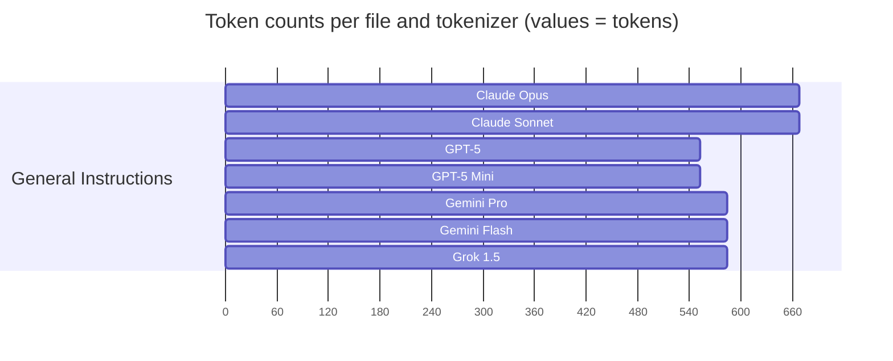

# Javascript Copilot Prompts

- [General Instructions](./general-instructions.md)
  - Average tokens count: 599

## Tokens statistics

```mermaid
%%{init: {'gantt': {'leftPadding': 200, 'rightPadding': 75, 'topPadding': 75, 'fontSize': 11, 'sectionFontSize': 16}}}%%
gantt
    title Token counts per file and tokenizer (values = tokens)
    dateFormat  X
    axisFormat  %s

    section General Instructions
    Claude Opus    : 0, 668
    Claude Sonnet  : 0, 668
    GPT-5          : 0, 553
    GPT-5 Mini     : 0, 553
    Gemini Pro     : 0, 584
    Gemini Flash   : 0, 584
    Grok 1.5       : 0, 584

```
