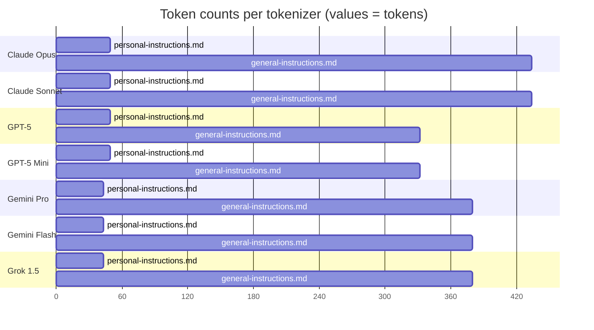

# Python Copilot Prompts

- [General with Typing Instructions](./general-with-typing-instructions.md)
  - Average tokens count:
- [Pytest Instructions](./pytest-instructions.md)

```mermaid
gantt
    title Token counts per tokenizer (values = tokens)
    dateFormat  X
    axisFormat  %s

    section Claude Opus
    personal-instructions.md : 0, 49
    general-instructions.md  : 0, 434

    section Claude Sonnet
    personal-instructions.md : 0, 49
    general-instructions.md  : 0, 434

    section GPT-5
    personal-instructions.md : 0, 49
    general-instructions.md  : 0, 332

    section GPT-5 Mini
    personal-instructions.md : 0, 49
    general-instructions.md  : 0, 332

    section Gemini Pro
    personal-instructions.md : 0, 43
    general-instructions.md  : 0, 380

    section Gemini Flash
    personal-instructions.md : 0, 43
    general-instructions.md  : 0, 380

    section Grok 1.5
    personal-instructions.md : 0, 43
    general-instructions.md  : 0, 380

```
